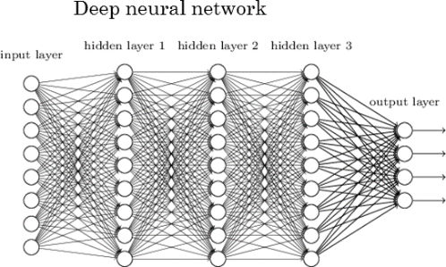

# Klasifikacija tumora dojke

## Sadržaj

1. [Uvod](#uvod)
2. [Uvod u Deep Learning (DL)](#uvod-u-deep-learning-(dl))
3. [Koraci izvršenja DL projekta](#koraci-izvršenja-dl-projekta)
4. [Zaključak](#zaključak)
5. [Reference](#reference)

## Uvod

## Uvod u Deep Learning (DL)

Da bi shvatili DL moramo se vratiti jedan korak nazad i shvatiti kako to mi ljudi čimo. Kada dodirnemo nešto vruće naš nervni sistem šalje tu informaciju nazad u mozak gdje ti podaci prolaze kroz naše neurone, te na osnovu tih podataka mi donosimo zaključak <b>ovo je vruće bolje je da sklonim ruku sa ovoga da se ne bih opržio.</b>

Kao što možete vidjeti na slikama iznad imamo neuron, i imamo skupinu neurona. Da bi smo prenijeli način ljudskog učenja morali smo prenijeti i našu arhitekturu učenja na mašinu. Tako smo dobili naše vještačke neuralne mreže.

Sada kada smo razumjeli konceptualni način učenja, sada trebamo to malo bolje shvatiti. Za nas su trenutno neuralne mreže crna kutija kojoj damo nešto i ona nam vrati nešto, ali ćemo sad demistificirati neuralne mreže.

Kao što vidite na slici imamo <b>input layer</b> koji nam služi kako bi dali našoj mreže neke inpute da bi na kraju dobili neki proizvod, u okviru svih ovih layera imamo ove kružiće koje od sad nazivamo neuroni. Broj neurona u <b>input layer-u</b> će zavisiti od toha koliko karakteristika imamo. Da pojasnimo to malo bliže, ako želimo da predvidimo kakvo će vrijeme biti sutra, gledaćemo kakvo je vrijeme danas bilo, vlažnost zraka, jačinu vjetra. Na osnovu ovih karakteristika ćemo predvidjeti kakvo će vrijeme biti sutra. 

Nabrojali smo 3 parametra (naravno da ima više parametra, ali ovo služi samo za primjer), znači da će naš <b>input layer</b> imati 3 neurona.

Sada našim neuronima dodijeljujemo vektore sa podacima za prethodnih n perioda. Šta to znači? Kada želimo predvidjeti neku vrijednost u ovom slučaju vrijeme za naredni dan, mi imamo bazu podataka u kojoj se nalaze podaci o vremenu prethodnih n dana. Sad svaki od nabrojanih parametar i njegov vektor dodjeljujemo jednom ulaznom neuronu.

Sada ćemo preći na <b>hidden layers</b> kojih može biti koliko nam je želja 5 - 10 i u okviru kojih može biti koliko nam je želja neurona. Kako se odlučuje pravilan broj ovih hyperparametara, ovdje nema tačnog odgovora jer sve zavisi od projekta do projekta. Utoku modeliranja, ćete morati sami to da otkrijete.

I na kraju <b>output layer</b>, kojih može biti više ili samo jedan ovisno šta želite predvidjeti. Ako želite klasificirati slike lava i tigra imat ćete dva neurona i taj broj će biti veće ukoliko imate više životinja koje želite da model prepozna, ukoliko želite da predvidite cijenu automobila imat ćete jedan neuron u izlaznom layeru.

Ok, ali šta su sad ove linije koje povezuju ove neurone? Te linije predstavljaju linearnu regresiju, ukoliko ne znate šta je <a href="https://hr.wikipedia.org/wiki/Linearna_regresija">linearna regresija</a> to možete vidjeti na tom linku, ali da skratimo priču, to predstavlja statistički metod predviđanja, a još stručnije to predstavlja Machine Learning.

Ali tu priča o tim linearnim regresijama u okviru neuralnih mreža ne staje, dodavati linearnu regresiju jednu na drugu nema smisla dobit ćemo neke random rezultate koji nam neće ništa govoriti. Zato ćemo sad uvesti još jedan hyperparametar, a on se zove aktivacijska funkcija. <a href="https://missinglink.ai/guides/neural-network-concepts/7-types-neural-network-activation-functions-right/">Aktivacijska funkcija</a> daje nelinearnost našim neuronima, što u konačnici donosi dobre rezultate. 

## Koraci izvršenja DL projekta

* Moramo posmatrati uopšteno, definisati naše probleme, način dubokog učenja
* Pribavljanje podataka
* Čišćenje i vizueliziranje podataka
* Priprema podataka za DL algoritam
* Selektovanje modela i treniranje
* Podešavanje modela
* Prezentiranje riješenja

  
Posmatranje šire slike

  

    Naš problem predstavlja validaciju doktorovog mošljenja, svi smo mi ljudi, a ljudi griješe, ovim projektom želimo smanjiti ljudske greške na minimum. U ovom slučaju budući da imamo dataset koristit ćemo supervizioni način dubokog učenja. Budući da imamo bazu podataka naših fotografija upoređivat ćemo dobijene rezultate iz neuralne mreže sa stvarnim rezultatima.
  

  <label for="gig_pic">Status</label>
  <progress id="big_pic" value=100 max=100>100%</progress>	✅

  
Pribavljanje podataka

  

    Dataset koji imamo je pribavljen sa <a href="www.kaggle.com">Kaggle</a>
  

  <label for="gig_pic">Status</label>
  <progress id="big_pic" value=100 max=100>100%</progress>	✅

<table>
  <thead>
    <tr>
    <td>Naziv faze</td>
    <td>Status</td>
    </tr>
  </thead>
  <tbody>
    <tr>
     <td>Posmatranje šire slike</td>
     <td>✅</td>
    </tr>
    <tr>
     <td>Pribavljanje podatak</td>
     <td>✅</td>
    </tr>
    <tr>
     <td>Čišćenje i vizueliziranje podataka</td>
     <td>❌</td>
    </tr>
    <tr>
     <td>Priprema podataka za DL algoritam</td>
     <td>❌</td>
    </tr>
    <tr>
     <td>Selektovanje modela i treniranje</td>
     <td>❌</td>
    </tr>
    <tr>
     <td>Podešavanje modela</td>
     <td>❌</td>
    </tr>
    <tr>
     <td>Prezentiranje riješenja</td>
     <td>❌</td>
    </tr>
  <tbody>
</table>

### Kompletan progrs projekta

U okivru ovog projekta kreirati samo riješenje ovog problema nije jedini zadatak, tako da imamo i druge zadatke:

Kreiranje riješenja ❌

  

    Kreiranje algoritma koji će klasificirati snimke tumora dojke.
    Osoba koja će raditi na ovom dijelu
    <a href="www.github.com/WorldWideWest">@Dženan Džafić</a>
  

  <progress value=0 max=100>

Uvod u Deep Learning ❌

  

    Način funkcionisanja neuralnih mreža
    Osoba koja će raditi na ovom dijelu
    <a href="www.github.com/WorldWideWest">@Dženan Džafić</a>
  

  <progress value=0 max=100>

Tematika tumora dojke❌

  

    Osoba/e koja će raditi na ovom dijelu
  

  <progress value=0 max=100>

  

Kreiranje dokumentacije i prezentacije ❌

  

    Osoba/e koje će rediti na ovom dijelu?
  

  <progress value=0 max=100>

<!-- refferences -->

<!--brain neural net https://www.google.com/search?q=neurons+in+the+brain&tbm=isch&ved=2ahUKEwjux8Sy9NLtAhWs2uAKHdu5AkUQ2-cCegQIABAA&oq=neuron&gs_lcp=CgNpbWcQARgAMgQIIxAnMgQIIxAnMgQIABATMgQIABATMgQIABATMgQIABATMgQIABATMgQIABATMgQIABATMgQIABATOgQIABADOgQIABAeUNBKWIZYYIxgaABwAHgAgAHRAYgBiweSAQUwLjUuMZgBAKABAaoBC2d3cy13aXotaW1nwAEB&sclient=img&ei=JzTaX66YJKy1gwfb84qoBA&bih=657&biw=1366#imgrc=aPwz_WaSViJqsM 

neuron - https://www.google.com/search?q=neurons&tbm=isch&ved=2ahUKEwiSlYq59NLtAhUJDhQKHUuLAxsQ2-cCegQIABAA&oq=neurons&gs_lcp=CgNpbWcQA1CX8QpYl_EKYNXzCmgAcAB4AIABAIgBAJIBAJgBAKABAaoBC2d3cy13aXotaW1nwAEB&sclient=img&ei=NTTaX9KmE4mcUMuWjtgB&bih=657&biw=1366#imgrc=wAhTvuq2Cvhy-M

neural networks - https://www.google.com/search?q=neural+network&tbm=isch&ved=2ahUKEwjG-cGP9dLtAhWL1uAKHSi5AIAQ2-cCegQIABAA&oq=neural&gs_lcp=CgNpbWcQARgAMgQIIxAnMgQIABATMgQIABATMgQIABATMgQIABATMgQIABATMgQIABATMgQIABATMgQIABATMgQIABATOgQIABADOgQIABAeUOPNGFip1Bhg0N8YaABwAHgBgAHiBIgBtRKSAQkyLTIuMi4xLjGYAQCgAQGqAQtnd3Mtd2l6LWltZ8ABAQ&sclient=img&ei=6jTaX8bcI4utgweo8oKACA&bih=657&biw=1366#imgrc=tENaOh3bT0G94M -->

<!-- 

  

 -->